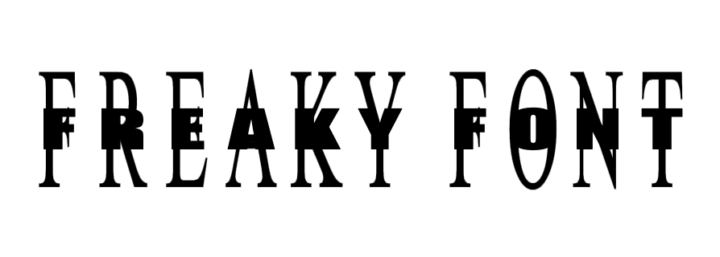

# Freaky Font Directory 🎨

A curated collection of interesting and unique font tool websites. These tools help you create amazing text effects and add creative elements to your design projects.

## Featured Tools

### [I AM MUSIC Font](https://iammusicfont.com/) 🎵

### [Papyrus Font Designer](https://papyrusfont.com) 📜

## Contributing

Feel free to submit more interesting font tool websites! Please submit via Pull Request or Issue.

## License

This project is licensed under the MIT License. For specific licensing of each font tool, please refer to their respective official websites.

[中文版 README](README_CN.md)

